# Driver
ML/DL

## 1. 选题背景

该项目是`kaggle`上的一个竞赛,其目的是检测正在驾驶的司机是否存在不安全行为.

项目的数据源是`State Farm`在很多汽车的仪表盘上装了摄像头,拍取了许多司机在驾驶过程中的行为图片.

随着移动互联网的发展，司机在驾驶过程中收到的干扰越来越多，在汽车上安置「驾 驶提醒」报警的需求越来越迫切。计算机视觉领域的发展也非常快,神经网络的出现,卷积神经网络在视觉领域对图片特征的提取,对图片进行识别分类上都工作的特别好,所以利用卷积神经网络技术可以来识别司机是否有不正当驾驶行为.

该项目采用了近几年在[LSVRC](http://www.image-net.org/challenges/LSVRC/)大赛上取得非常进展的卷积神经网络.

## 2. 问题描述

这个问题的本质是一个监督分类学习问题,通过对已经(包含各种不当行为的状态图片)标签好的训练集进行学习,提取出各个不当行为的状态的特征,来识别出新的输入状态的分别预测.

想解决对驾驶司机的驾驶状态进行识别,能够分析出驾驶人不当的行为,例如,玩手机,与他人交流,注意力不集中等不当行为.在实施的过程中,通过大量的[数据集](https://www.kaggle.com/c/state-farm-distracted-driver-detection/data)学习,使用训练好的模型对新的输入图片进行分类判断,可以得出当前司机的行为是否合法.

## 3. 数据集

数据集分为训练集和数据集,训练集有10个类别(c0-c9), 

- c0: 安全驾驶

- c1: 右手打字

- c2: 右手打电话

- c3: 左手打字

- c4: 左手打电话

- c5: 调收音机

- c6: 喝饮料

- c7: 拿后面的东西

- c8: 整理头发和化妆

- c9: 和其他乘客说话

测试集用于判断模型是否可靠,准确率是否能达到标准.

数据集的图片都是以`640*480`宽高,颜色通道为`RGB`

数据集全是以图片的形式存储,计算机可以像人一样去通过`看`图片识别状态,符合在计算机视觉的背景下的数据输入.

训练集的大小是`22483`,测试集的大小是`79726`.

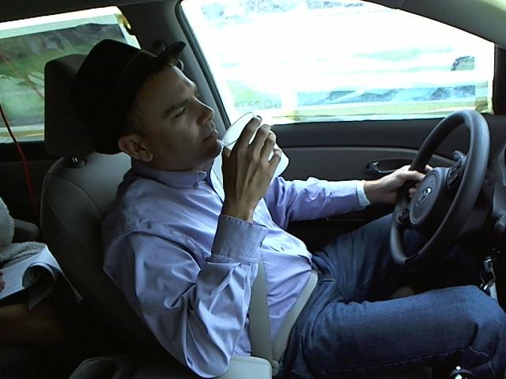

图2:C6 喝饮料

## 4. 解决方法

使用`opencv`读取测试图片数据,使用`numpy`来对数据的转换和提取,使用 `tensorflow`进行网络模型的构建和训练.

## 5. 评估

项目的问题是一个多分类的问题,主要有预测精确度和时间的标准.

通过损失函数(多分类交叉熵)来描述模型的性能,损失函数的值越大,模型的性能越差:

$logloss = -\frac{1}{N} \sum_{i=1}^N\sum_{j=1}^My_{ij}log(p_{ij})$ 

p:predict,y:test,i:(1,2,3,4,5,6,...,N(测试集的大小),j:1,2,3,4,5,6,..,M(分类数量))

时间:训练时长可以稍微长点,但是预测时长必须快,因为项目是要投入实际使用,如果预测过长,则没有实际意义.

在0.5秒以内可以去追求准确率的提高,预测时间大于0.5秒的则优先考虑预测时长,因为人也需要一定的反应时间,就算预测错误,进行提示,也比为了准确率而延迟进行提示更好,因为最后给予的反应时间太短,无法做出有效的动作.

## 设计

获取到数据集之后,通过`OpenCV`提取数据集的特征,观察图片的大小,色彩空间等属性.

搭建出卷积池化层,根据上一步分析到的图片数据属性,考虑不能过滤掉太多的属性,卷积核大小从`3*3`往上增加,输出神经元以`2^n`往上增加,池化层大小以`2*2`增加,因为池化层就避免了过拟合,所以不需要使用`dropout`函数来放弃一部分特征,权值使用`tensorflow`的正态分布随机产生,均值为0,标准差设置为0.01.

搭建全连接层,输出神经元数量以上一个卷积层输出接口保持不变或者指数级减少.

输出层需要有10个输出,因为有10个分类,损失函数会采用`Cross Entropy`,激活函数使用`softmax`,图片分类的数值也要转换为二进制的矩阵形式(正确归类的类别为1,其他的都为0).

softmax:

$o(C)k = e^ck / \sum_{k=0}^9e^ck$

C:(c0,c1...c9),K:(0,1,2,3,4,5,6,7,8,9)

使用 `tensorflow`构建损失函数,以及调优函数,通过梯度下降修改权值,设置`epoches`次数,考虑到设备的原因,可能无法设置到特别大,所以从5开始,初始`learning rate`设置为0.001,对模型进行训练,如果收敛太慢,适当增加学习率,如果训练结束模型还未收敛,则需要增加`epoches`次数,最终得到一个基本满意的模型,就可以对数据进行预测了.

## 6.实现方法

#### 数据预处理

对于大部分的机器学习项目来说,收集完数据的第一步应该就是进行数据预处理.

在该项目中,首先加载所有的文件名以及对应的类别,并使用`numpy.shuffle`将图片文件名和标签进行随机打乱,但是要保证映射关系.
读取打乱后的图片数据同时加载它们对应的类别,保证图片与类别是一一对应的关系(后续会改进,使用`ID`区分训练集和验证集).

接下来就是对图片进行了缩放和归一化处理,一是为了减少数据量,二是让数据集均值为零并且标准差为一的分布,模型对含有噪声的数据敏感度会降低.

项目使用了`VGG16`,`ResNet50`模型,将图片缩放为`224*224`,`InceptionV3`将图片处理为`299*299`大小.

使用了`OpenCV`将图片数据以`Numpy Array`形式存入内存,以及使用`Numpy`进行归一化和零均值处理.

### 实现

项目使用了自己搭建的简易卷积神经网络结构,以及`VGG16`,`ResNet50`,`InceptionV3`预训练模型.

#### 自己搭建卷积神经网络

网络有3个卷积层,每个卷积层后面接着一个最大池化层,激活函数都使用`relu`,第一个卷积层 kernel_size=(4,4),后两个都是(3,3),池化层size 都是(2,2),stride为(1,1),padding方式为`valid`,最后一个卷积层之后接展开层,展开层与 `dropout`连接,`keep-prob`为0.5,减少有效神经元神经元个数,最后输出层为`softmax`.

将图片尺寸缩放到`100*100`,`optimizer`为`adam`,`batch-size`32,`epochs`为5(因为计算资源有限,所以设置的比较小).

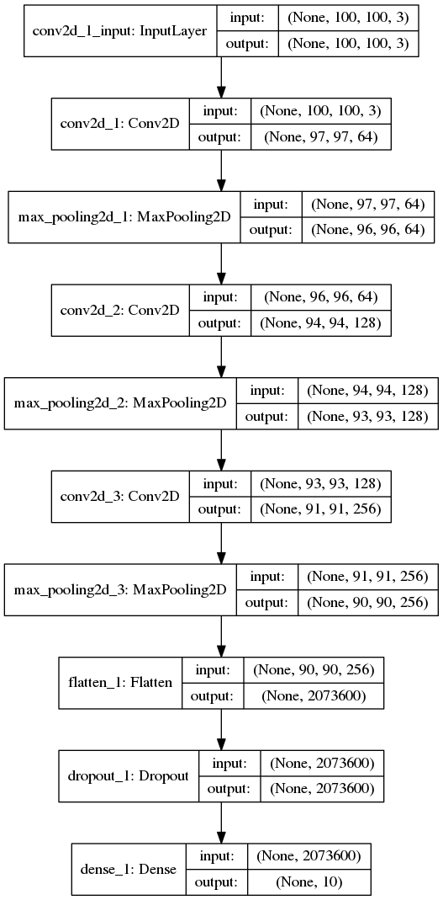

 图3:简单 CNN 模型结构

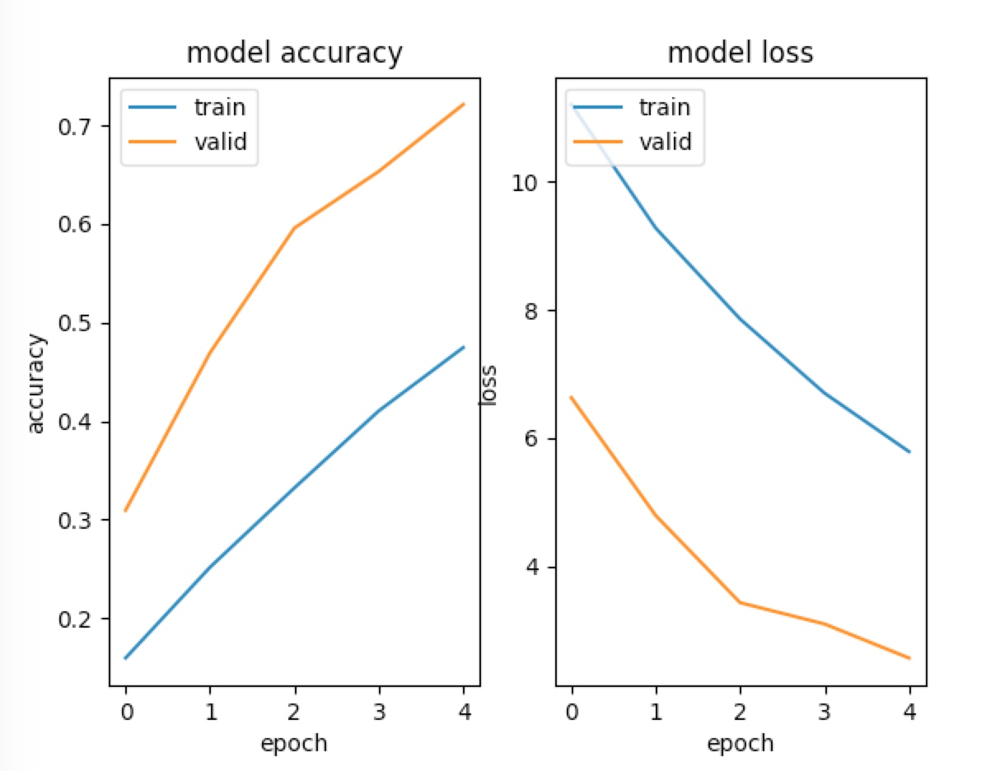

 图4:CNN 训练情况

因为训练的代数比较少,网络中存在`dropout`,所以验证集上表现比训练集好.

从图像观察到,准确率还在增加,如果增加 `epoch`,准确率应该还会有提升.

#### [VGG-16](https://arxiv.org/pdf/1711.09280.pdf)

上面使用了自己搭建的简单卷积神经网络进行测试,虽然有一定的效果,但是结果并不是很理想.一般来说,为了增加分类的准确率,一种方法是加深网络的层数,学习更多的特征,但是带来的是网络的变大,参数的变多,模型会变得非常难以训练,并且容易造成[权重爆炸[1]](https://en.wikipedia.org/wiki/Curse_of_dimensionality),另外,网络越深,过拟合的可能性越大.

卷积神经网络,低层卷积层记住图片了通用的特性,颜色,边缘,线条等,高层卷积层,则更加具体,形状,大小等特性,所以,可以使用已经训练好的模型,保留低层的权值,高层权值在我们自己的数据集上进行训练调整,如果我们本身数据集比较充分,则可以开放更多的层进行调整,更加适应我们自己的数据集,这种学习方式成为[transfer-leraning[2]]( http://cs231n.github.io/transfer-learning/)

`VGG`是在`LSVRC-14`提供的模型,它的16层和19层模型在图片分类上表现的很好,后来被称为`VGG16`和`VGG19`,`VGG`的结构比较简单,整个模型由几组相同大小的` kernel`卷积层组成,大小均为(3,3),每一个卷积层后面都有一个`Maxpooling`层.

在项目中,选择了使用 `Keras.application` 自带的`VGG16`模型,`weights`使用了`imagenet`预训练权值,输出层将原模型的`softmax-1000`修改为我们的`softmax-10`.

在训练的过程中,首先锁住了开始的10层,然后训练后面的层,从学习曲线可以看出,模型还在继续收敛中,如果增加 `epochs`, 应该还能提高准确率.

随着模型的收敛,可以根据数据集的大小适当的开放更多层去训练.

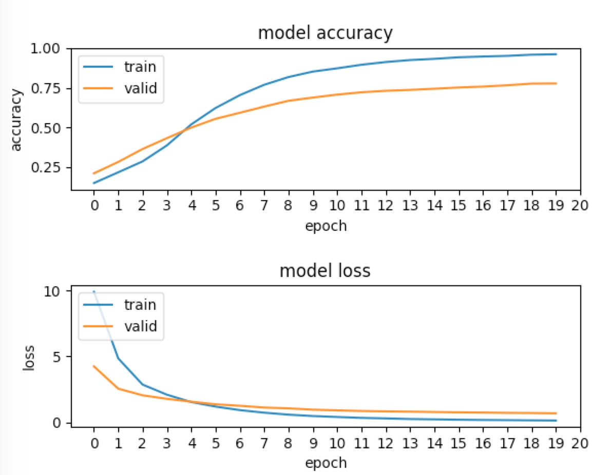

 图5:VGG训练

#### [InceptionV3](https://arxiv.org/pdf/1512.00567.pdf)

`GoogLeNet`打破了以往提高准确度,串行叠加卷积层的方式,而是采用并行,同一个卷积层,采用不同的卷积核来学习不同的特征,但是不同的卷积核怎么选择是通过大量的实验得知的.

`GoogLeNet`并行使用的多个`kernel`,并在最后结合多个`kernel`的输出,这个模块被称为`Inception Module`.

模型结构如下图所示:

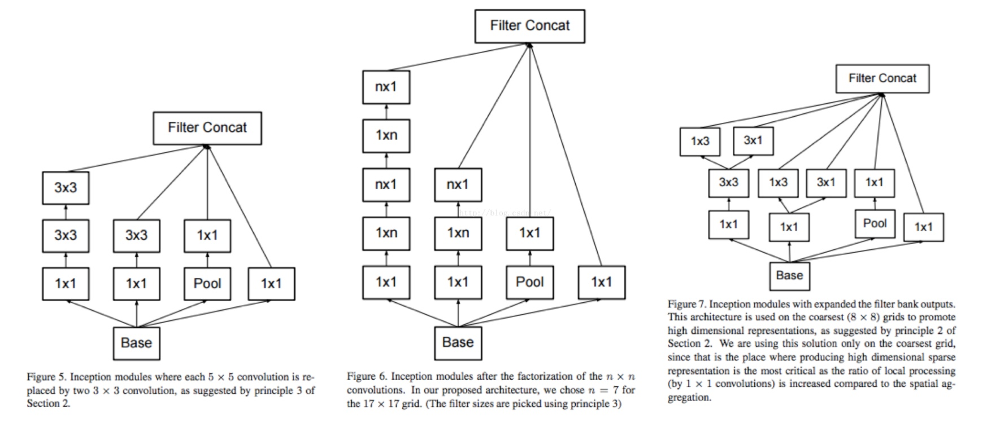

 图6:Inception 网络结构

如上图所示,有多个不同的`kernel`,每一个`kernel`学习到的特征都是不一样的,`1*1`学习比较细微的特征,`3*3`结合更多的像素,有更大的感受野,可能学习到了边界等特征,池化层避免过拟合.

要注意一点,每一个`filter`之前都有`1*1`的卷积,可以有效的减少计算量,减少输入给尺寸较大的`conv`的维度.

在这个实现中,使用`keras.application`自带的`InceptionV3`模型,权值使用`imagenet`,与VGG16类似,`include_top=False`,调整几个`top`层.

#### [Resnet50](https://arxiv.org/pdf/1512.03385.pdf)

`ResNet`在`ILSVRC2015`测试结果达到了`3.57% Top-5 error`,历史上第一个超过了`5% Top-5 error`.与`InceptionV3`相同,有非常深的网络结构,它有一个非常显著的特征,使用了`残差块`,如下图所示.

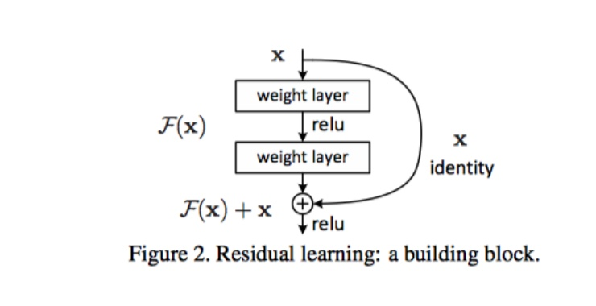

 图7:Resnet 网络结构

过去的结构都是上层的输出是下层的输入,但是`ResNet`残差模块,则引入了跨层的概念,某层的输入不只有上层的输出,可能有之前某一层的输出,如上图,下层接收了前面层的`X`,最后的表示为:H(x) = F(x) + X.
H:期望输出  F:卷积层输出  X: 跨层输出

在这之前深层网络有个问题,比较难以训练,有时表现的比浅层网络还差,所以`ResNet`的MSRA何凯明团队认为深层网络至少应该和浅层网络表现的一样好,那么在深层次建立一个和浅层的恒等映射. F(x) = H(x) - X,他们假设优化`F(x)`残差比直接优化`H(x)`容易.

在这个结构上也与之前的模型实现方式类似,首先使用`keras.applications`自带的`Resnet50`模型,然后不包含顶层,权值使用`imagenet`,训练顶层部分,锁住其他预训练层.

### 利用CAM可视化训练好的CNNs模型

对于一般的分类项目而言,一般也会需要物体定位(
 localization),利用我们可以可视化分类模型是否正确的分类,错误的分类是因为哪一部分的影响.该项目中使用了`Bolei Zhou`提出的[Class Activation Mapping[3]](http://cnnlocalization.csail.mit.edu/),高层卷积层通常学习的特征是比 较具体的特征以及它的位置信息,通过目标的敏感`kernel`按权值累加,即能获得目标分类的映射.

具体实现大体是,将深层卷积层的输出,通常会接一个`GAP(Global Average Pooling)`或者是全连接层,然后与权值做数量积,在映射会`Oriign Image`,颜色深的位置就代表了分类的特征,如下图所示.

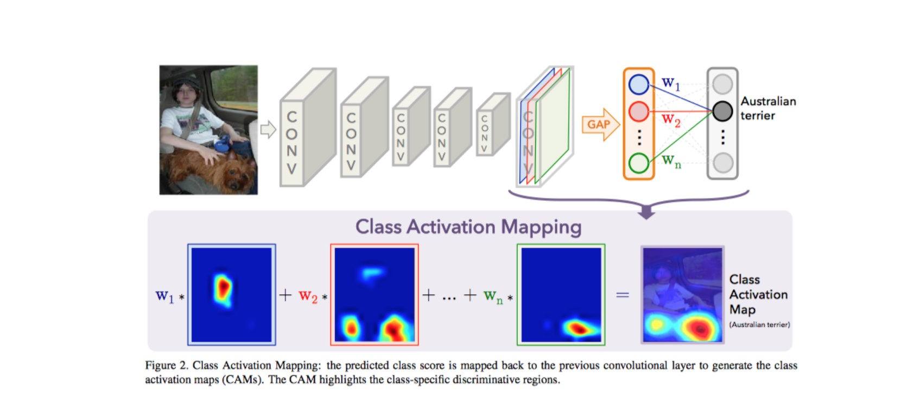

 图8:CAM 原理

项目利用`kears.application`自带的`VGG16`,`InceptionV3`,`Resnet50`模型,修改为对应的`Model-CAM`,在进行训练,最后得到三个模型的`CAM`可视化结果.

### 优化方案

在简单的`CNN`模型中,不难发现:
1. 模型训练不够充分
2. 收敛速度较慢
3. 预测结果不是很好
4. 数据在测试集上表现不好,数据泛化能力不强

根据这些问题可以有如下解决方法:
1. 增加训练的epochs
2. 调整学习率
3. (通过请教培文导师)通过司机`ID`拆分训练集和验证集,可以有效的提高准确率,并且使训练集与验证集使用不同的分布,确认模型的泛化能力.

#### 迁移学习的优化

除了具有上诉问题之外,使用迁移学习的网络结构存在:
1. 模型过拟合(因为添加了代数,所以没有欠拟合)

优化方式:
1. 使用 earylyStoping
在验证集的`loss`每一代的减少低于`1e-5`,连续五代出现这种情况,就认为模型在验证集上已经表现最好了,如果继续训练,则可能产生过拟合.
2. 添加 kernel_regular
添加正则项,可以有效的避免过拟合,保证每一步的权值更新不会太大.

## 7.结果

#### 模型验证和评估

在上面实现的几个模型中,我们可以得到以下的测试结果.

##### 简单卷积网络

该模型只是为了建立对卷积网络的了解,所以并未提交到`Kaggle`上,由于网络太过于简单,训练代数太少,没能学习到主要特征.

##### VGG16

 图9:VGG 得分

该模型在`Kaggle`上的得分为:`1.11232`,排名:`562/1444`,模型表现比上面的简单卷积网络表现好了非常多,可以看出来,模型的深度越深,模型表现更好,迁移学习还是非常有效果的.

##### InceptionV3

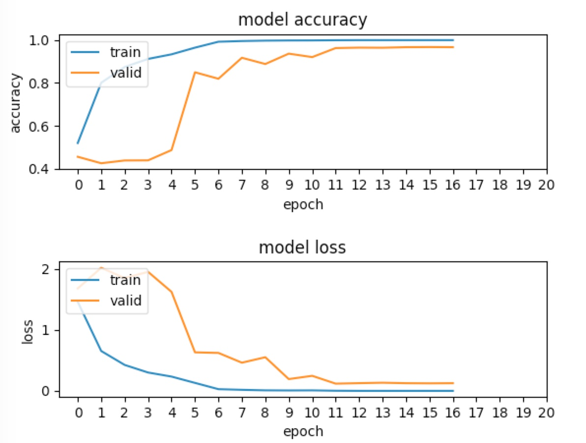

 图10:Inception 得分

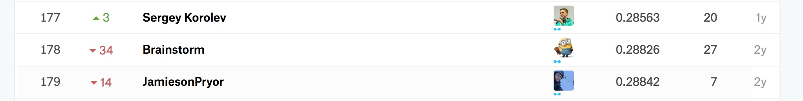

 图11:Kaggle 排名

该模型在`kaggle`上的得分为:` 0.28622`,排名为:`178/1440`,表现比`VGG`更优秀,也说明了卷积层数越多,模型学习到的特征会越多越准确.

##### ResNet50

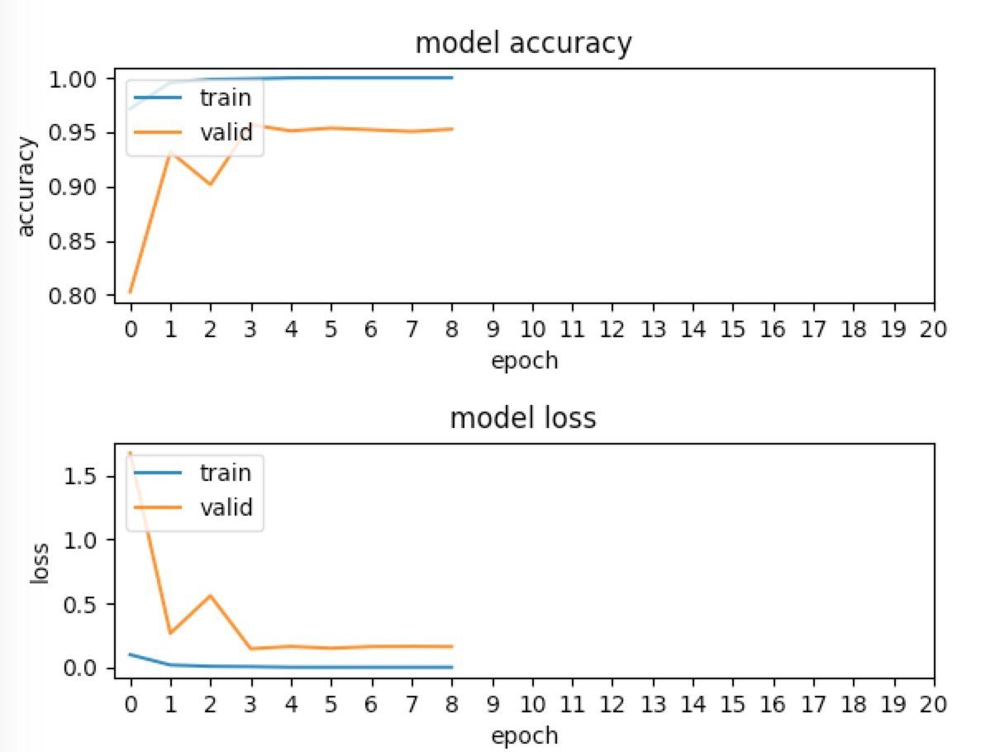

 图12:Resnet得分

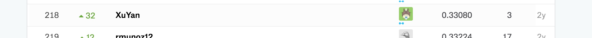

 图13:Resnet Kaggle排名

该模型在`kaggle`上的得分为:`0.30853` 排名为`219/1440`,是从学习曲线来看,该模型还有提升空间,可以提高`epochs`次数,微调更多的层,模型应该能表现更好.

训练时间对比:
|  模型 |  一代的训练时间/s |  一张图的预测时间/ms |
| ------------- |:-------------:| :-----:|
|     Simple_conv        |    517     |   0.8395495414733887      |
|     VGG16        |      430   |      1.1183714866638184   |
|     InceptionV3        |    897     |   1.489720106124878      |
|     ResNet50        |   662      |      2.076923131942749   |

得分对比:
|  模型 |  Private Leaderboard | public Leaderboard  |
| ------------- |:-------------:|:-----:|
|     VGG16        |    1.11232     |    1.21484     |
|     InceptionV3        |     0.37670    |   0.28622     |
|     ResNet50        |     0.30853   |      0.33172   |

在AWS 上的训练时长:

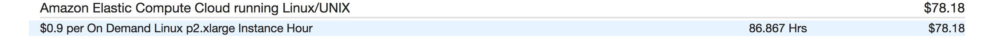

 图14:训练时长

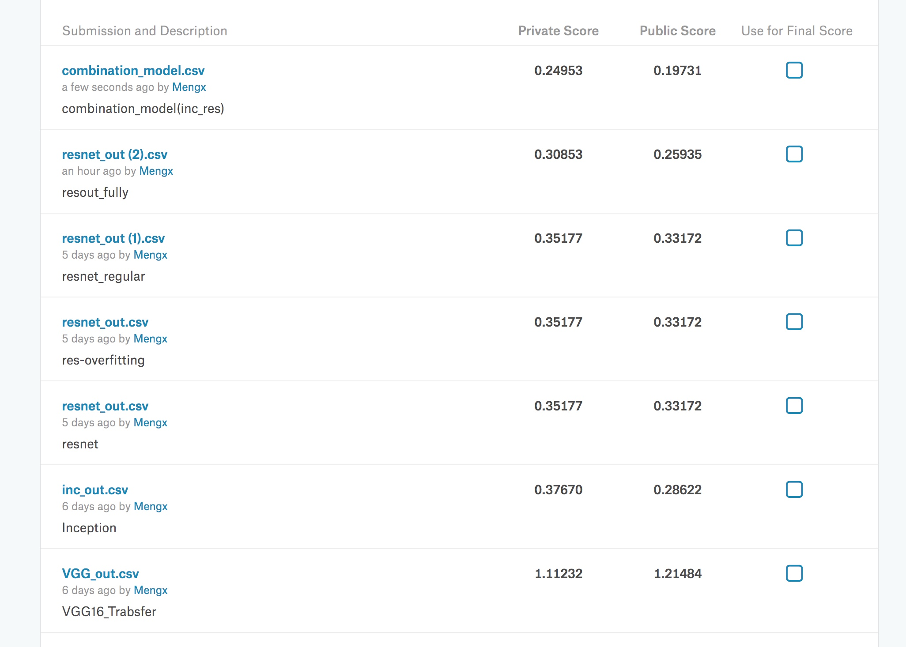

 图15:kaggle 提交结果

### 分析结果

在该项目中,并没有重新训练一个`ResNet-CAM`,直接使用了训练好的`ResNet`网络,取出了最后一个卷积层输出,然后取到了`softmax`层的权值,用以实现分类可视化.

查看一个错误分类的图片:

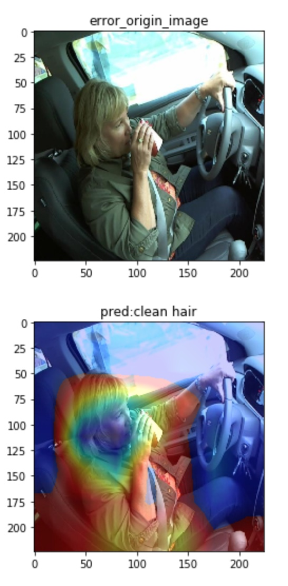

 图16:可视化错误分类

正确分类为:

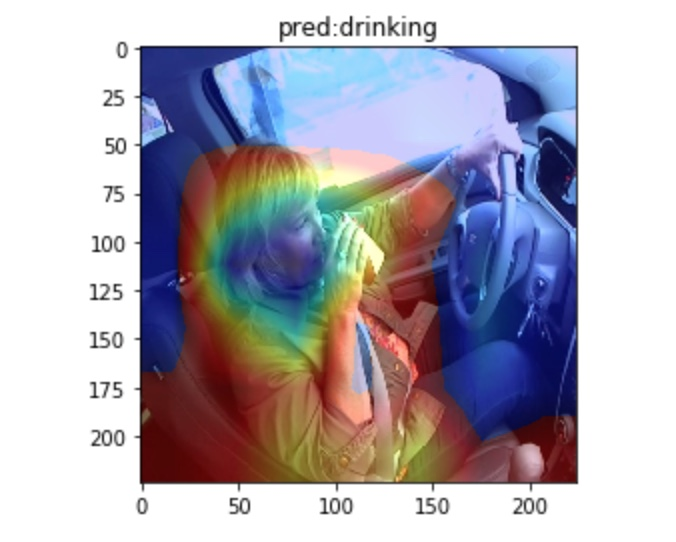

 图17:(error)正确分类

模型在几个类别之中徘徊,无法确定一个正确分类.

查看正确分类的图片:

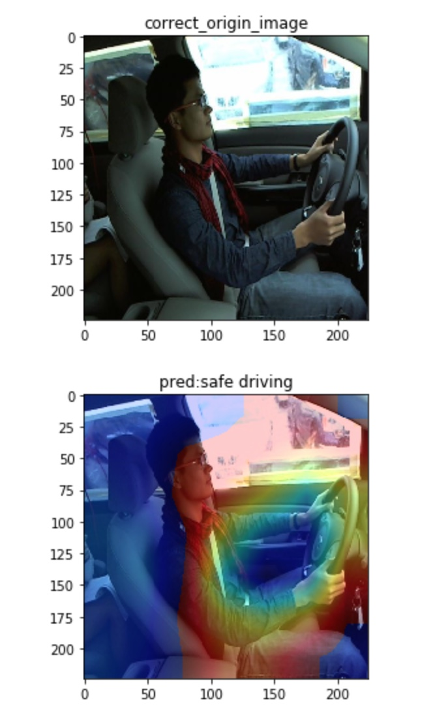 图18:可视化正确预测

## 8.结论

在该项目的开始,首先使用自己搭建的简单卷积神经网络,观察到卷积网络确实能起作用,能自己学习特征,并确定了优化方式,在接下来的预训练模型上进行实施.

该项目计算消耗资源较多,采用了迁移学习的方式,极大的减少了训练时长,在深度网络中需要的数据集是海量的,迁移学习也能有效的避免数据集不足的问题.

### 后续改进

该项目总共只用了15代来微调`pre-trained`,从学习曲线来看, 有的学习曲线还呈下降的趋势,如果继续增加训练代数,效果可能会更好.

如果对数据集进行进一步的处理,例如clip出司机部分的子图,这样模型可以避免学习到不必要的特征,
例如车身装饰,结构等,还可以对数据进行增强处理,同时增加训练代数,模型的泛化能力也会增强,可能最后模型在测试集上会表现更好.

可以使用多模型融合的方式.
* 例如训练几个预训练模型,然后提取出卷积特征,结合特征,在单独训练最后几个分类层,可能会有更好的结果.
* 也可以多模型结果去平均值,但是模型的得分应该要差不多的,不然会拉低最后结果.
* 一个模型分别在不同的司机ID上训练,然后去取这几个模型的均值.

